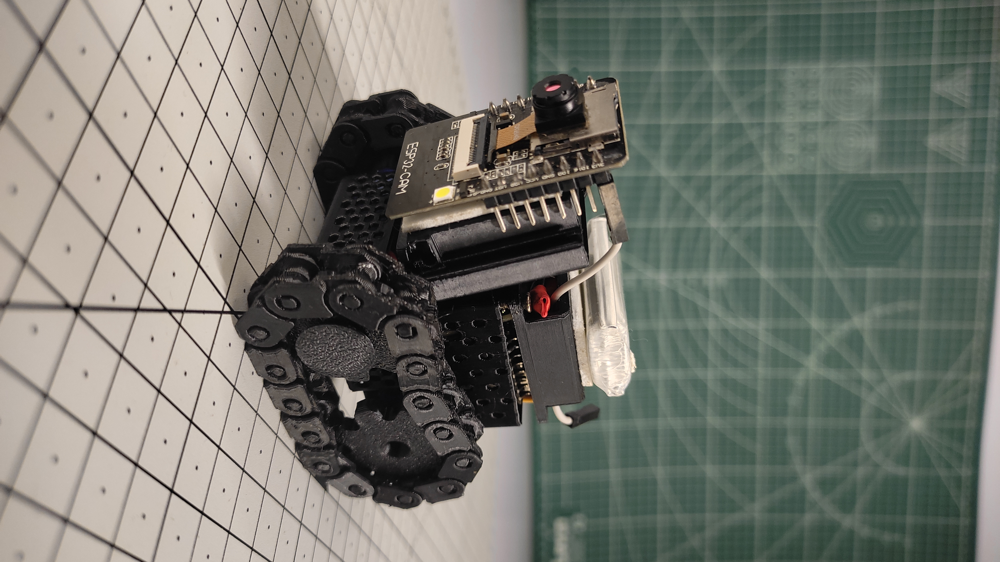
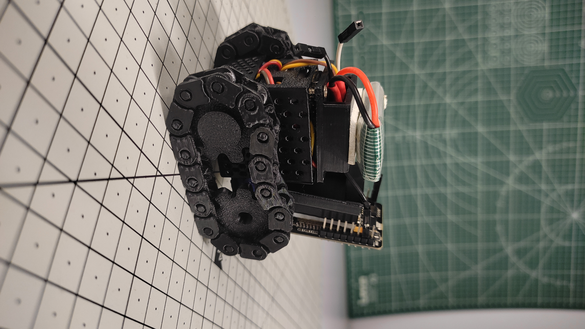
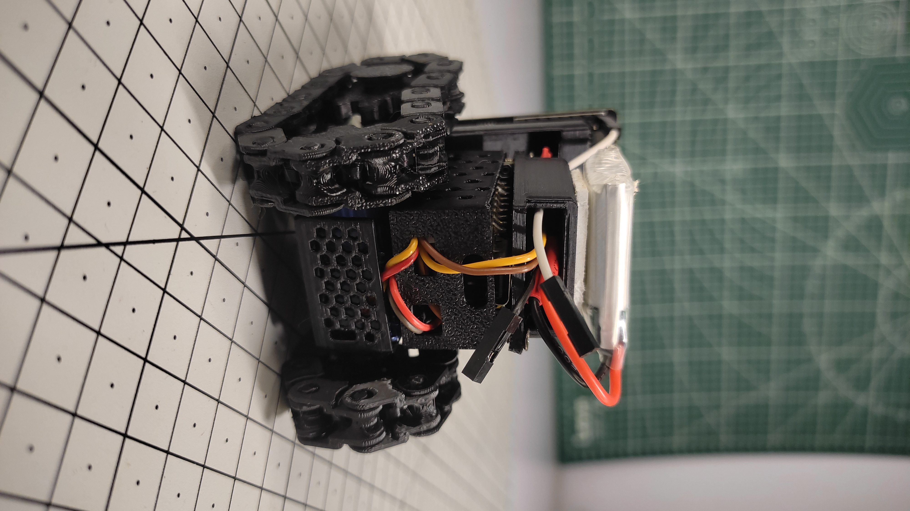
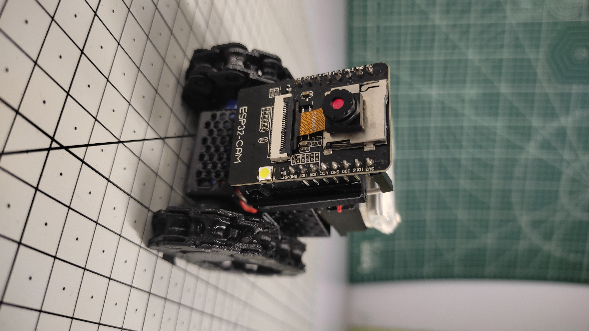

# TechWithPi-Mini-WiFi-Spy-Robot
A compact WiFi-controlled mini robot built with ESP32-C3 and ESP32-CAM, featuring wireless movement control and real-time live video streaming.  The project uses two modified SG90 servo motors for movement, a DRV8833 motor driver for motor control, and an ESP32-CAM to stream live video to a smartphone. 
# ESP32-C3 WiFi Robot with ESP32-CAM Live Streaming

Real-time WebSocket-controlled robot built on ESP32-C3, with a separate ESP32-CAM module streaming live video — both accessed from a single mobile-friendly web dashboard.

## Features

- ✅ ESP32-C3 WebSocket server for real-time robot control
- ✅ ESP32-CAM live MJPEG stream embedded directly in the control page
- ✅ Forward / Backward / Left / Right / Stop
- ✅ Press-and-hold to move, release to stop instantly
- ✅ Auto-reconnect on WiFi drop, with automatic motor safety-stop
- ✅ Dark glassmorphism mobile-friendly UI, no app required — just a browser

## Hardware Used

| Component | Purpose |
|---|---|
| ESP32-C3 | Runs the web server, WebSocket server, and motor control logic |
| ESP32-CAM | Streams live video independently over `/stream` |
| Motor driver (L298N / L293D) | Drives the 2 DC motors |
| 2x DC Motors | Robot drive |
| Separate battery pack for motors | Powers the motor driver (kept isolated from the ESP32's own supply) |

### GPIO Mapping (ESP32-C3)

| Pin | Function |
|---|---|
| GPIO 1 | IN1 (Motor A) |
| GPIO 2 | IN2 (Motor A) |
| GPIO 3 | IN3 (Motor B) |
| GPIO 4 | IN4 (Motor B) |

## Network Architecture

This project intentionally runs **two ESP32 devices on the same mobile hotspot network**, each doing a very different job:

- **ESP32-CAM** → connects to the phone's **mobile hotspot** and serves a continuous MJPEG stream at `http://<cam-ip>/stream`
- **ESP32-C3 (robot)** → connects to the **same hotspot**, but instead of plain HTTP polling, it runs a **WebSocket server on port 81** for control commands

### Why WebSocket instead of plain HTTP requests

A live video stream is heavy, continuous traffic that can dominate a phone hotspot's limited radio bandwidth. Repeated short-lived HTTP requests (`fetch("/move?d=F")` per button press) compete poorly against that stream for airtime, causing missed/delayed commands and WiFi beacon drops.

A single persistent WebSocket connection avoids the overhead of opening a new HTTP connection per command, sends much smaller frames, and is significantly more resilient to the same congested network the camera is saturating.

### Reliability measures in firmware

- `WiFi.setSleep(false)` — disables modem sleep so beacons aren't missed under network congestion
- `WiFi.setTxPower(...)` — boosts transmit power for a more stable link on a congested hotspot
- Auto-reconnect loop — on WiFi disconnect, motors are stopped immediately for safety, then the ESP32 attempts to rejoin the network without a full reboot
- WebSocket `onclose`/`onopen` handling in the browser — the dashboard shows live connection status and auto-reconnects the socket if it drops

## Setup

1. Install the **WebSockets** library by Markus Sattler via Arduino Library Manager
2. Flash `esp32_robot_control.ino` to the ESP32-C3, after setting your hotspot credentials:
   ```cpp
   const char* ssid = "YOUR_HOTSPOT_NAME";
   const char* password = "YOUR_HOTSPOT_PASSWORD";
   ```
3. Flash the ESP32-CAM with its own streaming sketch, connected to the **same hotspot**
4. Open the Serial Monitor (115200 baud) on the robot — it prints the IP once connected:
   ```
   Robot connected! Open this in browser: http://<robot-ip>
   ```
5. Open that IP in a mobile browser — the dashboard loads the camera stream and control D-pad together


## Credits

Built and documented by [TechWithPi](https://www.youtube.com/@TechWithPi1) — ESP32, Arduino, robotics and IoT projects.
🤖 **TechWithPi AI:** [Try TechWithPi AI](https://techwithpi.in/)

### Robot

<p align="center">
  
</p>

### Robot 2

<p align="center">
  
</p>

### Robot 3

<p align="center">
  
</p>

### Robot 4

<p align="center">
  
</p>

### Robot 5

<p align="center">
  
</p>


Copyright © 2026 TechWithPi. All Rights Reserved.

This project and its source code are the property of TechWithPi.
You may view the source code for personal and educational reference,
but copying, redistributing, modifying, or republishing this code
without permission is not allowed.
