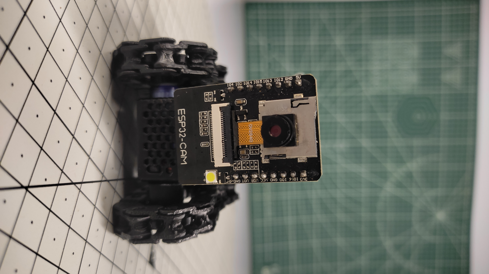

# TechWithPi-Mini-WiFi-Spy-Robot
A compact WiFi-controlled mini robot built with ESP32-C3 and ESP32-CAM, featuring wireless movement control and real-time live video streaming.  The project uses two modified SG90 servo motors for movement, a DRV8833 motor driver for motor control, and an ESP32-CAM to stream live video to a smartphone. 

Copyright © 2026 TechWithPi. All Rights Reserved.

This project and its source code are the property of TechWithPi.
You may view the source code for personal and educational reference,
but copying, redistributing, modifying, or republishing this code
without permission is not allowed.
